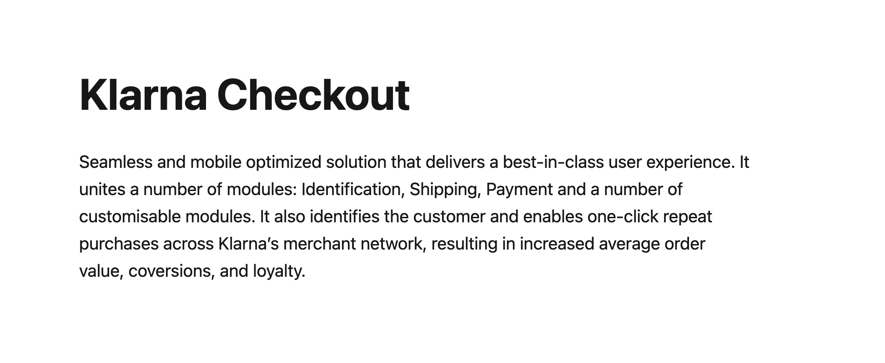

<div align="left">

[](https://klarna.com)

# [Klarna](https://klarna.com)<a id="klarna"></a>

The checkout API is used to create a checkout with Klarna and update the checkout order during the purchase. As soon as the purchase is completed the order should be read and handled using the [`Order Management API`](https://docs.klarna.com/api/ordermanagement).\n\nRead more on [Klarna checkout](https://docs.klarna.com/klarna-checkout/).

</div>

## Table of Contents<a id="table-of-contents"></a>

<!-- toc -->

- [Installation](#installation)
- [Getting Started](#getting-started)
- [Reference](#reference)
  * [`klarnacheckout.order.abortOrder`](#klarnacheckoutorderabortorder)
  * [`klarnacheckout.order.createNewOrder`](#klarnacheckoutordercreateneworder)
  * [`klarnacheckout.order.getOrderDetails`](#klarnacheckoutordergetorderdetails)
  * [`klarnacheckout.order.updateOrder`](#klarnacheckoutorderupdateorder)

<!-- tocstop -->

## Installation<a id="installation"></a>
<div align="center">
  <a href="https://konfigthis.com/sdk-sign-up?company=Klarna&serviceName=Checkout&language=TypeScript">
    
  </a>
</div>

## Getting Started<a id="getting-started"></a>

```typescript
import { KlarnaCheckout } from "klarna-checkout-typescript-sdk";

const klarnacheckout = new KlarnaCheckout({
  // Defining the base path is optional and defaults to https://api.klarna.com
  // basePath: "https://api.klarna.com",
});

const abortOrderResponse = await klarnacheckout.order.abortOrder({
  orderId: "orderId_example",
});

console.log(abortOrderResponse);
```

## Reference<a id="reference"></a>


### `klarnacheckout.order.abortOrder`<a id="klarnacheckoutorderabortorder"></a>

Mark an order as aborted.

#### 🛠️ Usage<a id="🛠️-usage"></a>

```typescript
const abortOrderResponse = await klarnacheckout.order.abortOrder({
  orderId: "orderId_example",
});
```

#### ⚙️ Parameters<a id="⚙️-parameters"></a>

##### orderId: `string`<a id="orderid-string"></a>

#### 🔄 Return<a id="🔄-return"></a>

[Order](./models/order.ts)

#### 🌐 Endpoint<a id="🌐-endpoint"></a>

`/checkout/v3/orders/{order_id}/abort` `POST`

[🔙 **Back to Table of Contents**](#table-of-contents)

---


### `klarnacheckout.order.createNewOrder`<a id="klarnacheckoutordercreateneworder"></a>

To create a new order simply provide a JSON object with the applicable properties.<br>The location of the newly created checkout order can be found in the location header of the response.<br>Please note: This is the url that should be used for future interactions (read and update) with the order, i.e. do not construct the order url based on the order id.

#### 🛠️ Usage<a id="🛠️-usage"></a>

```typescript
const createNewOrderResponse = await klarnacheckout.order.createNewOrder({
  order_id: "f3392f8b-6116-4073-ab96-e330819e2c07",
  name: "Women's Fashion",
  purchase_country: "US",
  purchase_currency: "USD",
  locale: "en-US",
  status: "CHECKOUT_INCOMPLETE",
  order_amount: 50000,
  order_tax_amount: 4545,
  order_lines: [
    {
      type: "physical",
      reference: "19-402-USA",
      name: "Red T-Shirt",
      quantity: 5,
      quantity_unit: "pcs",
      unit_price: 10000,
      tax_rate: 1000,
      total_amount: 50000,
      total_discount_amount: 0,
      total_tax_amount: 4545,
      merchant_data:
        '{"marketplace_seller_info":[{"product_category":"Women\'s Fashion","product_name":"Women Sweatshirt"}]}',
      product_url: "https://www.example.com/products/f2a8d7e34",
      image_url: "https://www.exampleobjects.com/product-image-1200x1200.jpg",
    },
  ],
  html_snippet:
    "<div id='klarna-checkout-container'><script>alert('Initializing Klarna Checkout');</script></div>",
  merchant_reference1: "45aa52f387871e3a210645d4",
  merchant_reference2: "45aa52f387871e3a210645d4",
  merchant_data:
    '{"marketplace_seller_info":[{"product_category":"Women\'s Fashion","product_name":"Women Sweatshirt"}]}',
});
```

#### ⚙️ Parameters<a id="⚙️-parameters"></a>

##### purchase_country: `string`<a id="purchase_country-string"></a>

The purchase country of the merchant\\\'s store. The format to be used is ISO 3166 alpha-2. Eg: GB, SE, DE, US, etc.   Note: purchase country and currency need to match the defined merchant configuration. For global configuration read this https://docs.klarna.com/klarna-checkout/popular-use-cases/selling-to-multiple-countries/

##### purchase_currency: `string`<a id="purchase_currency-string"></a>

The purchase currency of the merchant\\\'s store. The format to be used is ISO 4217. Eg: USD, EUR, SEK, GBP, etc.  Note: purchase country and currency need to match the defined merchant configuration. For global configuration read this https://docs.klarna.com/klarna-checkout/popular-use-cases/selling-to-multiple-countries/

##### locale: `string`<a id="locale-string"></a>

Used to define the language and region of the customer. RFC 1766 customer\\\'s locale.

##### order_amount: `number`<a id="order_amount-number"></a>

Total amount of the order including tax and any available discounts. The value should be in non-negative minor units.  Example: 25 Euros should be 2500.

##### order_tax_amount: `number`<a id="order_tax_amount-number"></a>

Total tax amount of the order. The value should be in non-negative minor units.  Example: 25 Euros should be 2500.

##### order_lines: [`OrderLine`](./models/order-line.ts)[]<a id="order_lines-orderlinemodelsorder-linets"></a>

An array containing list of line items that are part of this order. Maximum of 1000 line items could be processed in a single order.

##### tags: `string`[]<a id="tags-string"></a>

Extra information added to the order.  Example: [\\\"dangerous_goods\\\", \\\"bulky\\\"]

##### order_id: `string`<a id="order_id-string"></a>

Unique order ID that will be used for the entire lifecycle of the order. (max 255 characters)

##### name: `string`<a id="name-string"></a>

The merchant name (max 255 characters).

##### status: `string`<a id="status-string"></a>

The current status of the order. The status will be ‘incomplete’ until the customer has been successfully authorized.

##### billing_address: [`Address`](./models/address.ts)<a id="billing_address-addressmodelsaddressts"></a>

##### shipping_address: [`Address`](./models/address.ts)<a id="shipping_address-addressmodelsaddressts"></a>

##### customer: [`Customer`](./models/customer.ts)<a id="customer-customermodelscustomerts"></a>

##### merchant_urls: [`MerchantUrls`](./models/merchant-urls.ts)<a id="merchant_urls-merchanturlsmodelsmerchant-urlsts"></a>

##### html_snippet: `string`<a id="html_snippet-string"></a>

The HTML snippet that is used to render the checkout in an iframe.

##### merchant_reference1: `string`<a id="merchant_reference1-string"></a>

Used for storing merchant\\\'s internal order number or other reference. If set, will be shown on the confirmation page as \\\"order number\\\" . The value is also available in the settlement files. (max 255 characters). Example: \\\"45aa52f387871e3a210645d4\\\"

##### merchant_reference2: `string`<a id="merchant_reference2-string"></a>

Used for storing merchant\\\'s internal order number or other reference. The value is available in the settlement files. (max 255 characters). Example: \\\"45aa52f387871e3a210645d4\\\"

##### started_at: `string`<a id="started_at-string"></a>

ISO 8601 datetime. The date and time when the order has been created. The format will be as follows: \\\"yyyy-mm-ddThh:mm:ssZ\\\"

##### completed_at: `string`<a id="completed_at-string"></a>

ISO 8601 datetime. The date and time when the order has been completed. The format will be as follows: \\\"yyyy-mm-ddThh:mm:ssZ\\\"

##### last_modified_at: `string`<a id="last_modified_at-string"></a>

ISO 8601 datetime. The date and time when the order was last modified. The format will be as follows: \\\"yyyy-mm-ddThh:mm:ssZ\\\"

##### options: [`Options`](./models/options.ts)<a id="options-optionsmodelsoptionsts"></a>

##### attachment: [`Attachment`](./models/attachment.ts)<a id="attachment-attachmentmodelsattachmentts"></a>

##### external_payment_methods: [`PaymentProvider`](./models/payment-provider.ts)[]<a id="external_payment_methods-paymentprovidermodelspayment-providerts"></a>

List of external payment methods that will be displayed as part of payment methods in the checkout.

##### external_checkouts: [`PaymentProvider`](./models/payment-provider.ts)[]<a id="external_checkouts-paymentprovidermodelspayment-providerts"></a>

List of external checkouts that will be displayed as part of payment methods in the checkout. The image_url is required, and the image size has to be 276x48px

##### shipping_countries: `string`[]<a id="shipping_countries-string"></a>

List of allowed shipping countries for this order in ISO-3166 alpha-2 format.  If specified, the customer will be able to change the shipping country in the checkout and you will be notified through ‘address_update’ callback or the ‘shipping_address_change’ javascript event.   If not specified then the default value will be the purchase country.  Example: look at billing_countries example.

##### shipping_options: [`ShippingOption`](./models/shipping-option.ts)[]<a id="shipping_options-shippingoptionmodelsshipping-optionts"></a>

A list of shipping options available for this order.

##### merchant_data: `string`<a id="merchant_data-string"></a>

Pass through field to send any information about the order to be used later for reference while retrieving the order details (max 6000 characters).

##### gui: [`Gui`](./models/gui.ts)<a id="gui-guimodelsguits"></a>

##### merchant_requested: [`MerchantRequested`](./models/merchant-requested.ts)<a id="merchant_requested-merchantrequestedmodelsmerchant-requestedts"></a>

##### selected_shipping_option: [`ShippingOption`](./models/shipping-option.ts)<a id="selected_shipping_option-shippingoptionmodelsshipping-optionts"></a>

##### recurring: `boolean`<a id="recurring-boolean"></a>

Indicates whether this purchase will create a token that can be used by the merchant to create recurring purchases. This must be enabled for the merchant to use. Default: false  Depending on specified country, recurring could be used for the following payment methods: Pay Later, Direct Debit, Card.

##### recurring_token: `string`<a id="recurring_token-string"></a>

Token to be used when creating recurring orders.

##### recurring_description: `string`<a id="recurring_description-string"></a>

Description to be added to the recurring order.

##### billing_countries: `string`[]<a id="billing_countries-string"></a>

List of allowed billing countries for this order. If specified, the customer will be able to change the billing country in the checkout and you will be notified through ‘country_change’ callback or the ‘billing_address_change’ javascript event. If not specified but shipping_countries is specified, will use same values as shipping_countries. If not specified and shipping_countries is not specified, then the default value will be the purchase country.  Example: [\\\"AD\\\", \\\"AE\\\", \\\"AG\\\", \\\"AI\\\", \\\"AL\\\", \\\"AM\\\", \\\"AQ\\\", \\\"AR\\\", \\\"AS\\\", \\\"AT\\\", \\\"AU\\\", \\\"AW\\\", \\\"AX\\\", \\\"AZ\\\", \\\"BA\\\", \\\"BB\\\", \\\"BD\\\", \\\"BE\\\", \\\"BF\\\", \\\"BG\\\", \\\"BH\\\", \\\"BJ\\\", \\\"BL\\\", \\\"BM\\\", \\\"BN\\\", \\\"BO\\\", \\\"BQ\\\", \\\"BR\\\", \\\"BS\\\", \\\"BT\\\", \\\"BW\\\", \\\"BY\\\", \\\"BZ\\\", \\\"CA\\\", \\\"CF\\\", \\\"CH\\\", \\\"CI\\\", \\\"CK\\\", \\\"CL\\\", \\\"CM\\\", \\\"CN\\\", \\\"CO\\\", \\\"CR\\\", \\\"CU\\\", \\\"CV\\\", \\\"CW\\\", \\\"CX\\\", \\\"CY\\\", \\\"CZ\\\", \\\"DE\\\", \\\"DJ\\\", \\\"DK\\\", \\\"DM\\\", \\\"DO\\\", \\\"DZ\\\", \\\"EC\\\", \\\"EE\\\", \\\"EG\\\", \\\"ER\\\", \\\"ES\\\", \\\"ET\\\", \\\"FI\\\", \\\"FJ\\\", \\\"FK\\\", \\\"FM\\\", \\\"FO\\\", \\\"FR\\\", \\\"GA\\\", \\\"GB\\\", \\\"GD\\\", \\\"GE\\\", \\\"GF\\\", \\\"GG\\\", \\\"GH\\\", \\\"GI\\\", \\\"GL\\\", \\\"GM\\\", \\\"GN\\\", \\\"GP\\\", \\\"GR\\\", \\\"GS\\\", \\\"GT\\\", \\\"GU\\\", \\\"GY\\\", \\\"HK\\\", \\\"HN\\\", \\\"HR\\\", \\\"HU\\\", \\\"ID\\\", \\\"IE\\\", \\\"IL\\\", \\\"IM\\\", \\\"IN\\\", \\\"IS\\\", \\\"IT\\\", \\\"JE\\\", \\\"JM\\\", \\\"JO\\\", \\\"JP\\\", \\\"KE\\\", \\\"KG\\\", \\\"KI\\\", \\\"KM\\\", \\\"KN\\\", \\\"KR\\\", \\\"KW\\\", \\\"KY\\\", \\\"KZ\\\", \\\"LA\\\", \\\"LA\\\", \\\"LB\\\", \\\"LC\\\", \\\"LI\\\", \\\"LK\\\", \\\"LR\\\", \\\"LS\\\", \\\"LT\\\", \\\"LU\\\", \\\"LV\\\", \\\"MA\\\", \\\"MC\\\", \\\"MD\\\", \\\"ME\\\", \\\"MF\\\", \\\"MG\\\", \\\"MH\\\", \\\"MK\\\", \\\"MK\\\", \\\"ML\\\", \\\"MM\\\", \\\"MN\\\", \\\"MO\\\", \\\"MP\\\", \\\"MQ\\\", \\\"MR\\\", \\\"MT\\\", \\\"MU\\\", \\\"MV\\\", \\\"MW\\\", \\\"MX\\\", \\\"MY\\\", \\\"MZ\\\", \\\"NA\\\", \\\"NC\\\", \\\"NE\\\", \\\"NF\\\", \\\"NG\\\", \\\"NI\\\", \\\"NL\\\", \\\"NO\\\", \\\"NP\\\", \\\"NR\\\", \\\"NU\\\", \\\"NZ\\\", \\\"OM\\\", \\\"PA\\\", \\\"PE\\\", \\\"PF\\\", \\\"PG\\\", \\\"PH\\\", \\\"PK\\\", \\\"PL\\\", \\\"PM\\\", \\\"PR\\\", \\\"PS\\\", \\\"PT\\\", \\\"PW\\\", \\\"PY\\\", \\\"QA\\\", \\\"RE\\\", \\\"RO\\\", \\\"RS\\\", \\\"RU\\\", \\\"RW\\\", \\\"SA\\\", \\\"SB\\\", \\\"SC\\\", \\\"SE\\\", \\\"SG\\\", \\\"SH\\\", \\\"SI\\\", \\\"SJ\\\", \\\"SK\\\", \\\"SL\\\", \\\"SM\\\", \\\"SN\\\", \\\"SR\\\", \\\"ST\\\", \\\"SV\\\", \\\"SX\\\", \\\"SZ\\\", \\\"TC\\\", \\\"TF\\\", \\\"TG\\\", \\\"TH\\\", \\\"TJ\\\", \\\"TK\\\", \\\"TL\\\", \\\"TO\\\", \\\"TR\\\", \\\"TT\\\", \\\"TV\\\", \\\"TW\\\", \\\"TZ\\\", \\\"UA\\\", \\\"UG\\\", \\\"UM\\\", \\\"US\\\", \\\"UY\\\", \\\"UZ\\\", \\\"VA\\\", \\\"VC\\\", \\\"VG\\\", \\\"VI\\\", \\\"VN\\\", \\\"VU\\\", \\\"WF\\\", \\\"WS\\\", \\\"XK\\\", \\\"YT\\\", \\\"ZA\\\", \\\"ZM\\\", \\\"ZW\\\"]\\\"

##### discount_lines: [`DiscountLine`](./models/discount-line.ts)[]<a id="discount_lines-discountlinemodelsdiscount-linets"></a>

List of discounts applied to this order via the KCO discount-service

##### KlarnaPartner: `string`<a id="klarnapartner-string"></a>

#### 🔄 Return<a id="🔄-return"></a>

[Order](./models/order.ts)

#### 🌐 Endpoint<a id="🌐-endpoint"></a>

`/checkout/v3/orders` `POST`

[🔙 **Back to Table of Contents**](#table-of-contents)

---


### `klarnacheckout.order.getOrderDetails`<a id="klarnacheckoutordergetorderdetails"></a>

Get the full details of a Klarna checkout order.

#### 🛠️ Usage<a id="🛠️-usage"></a>

```typescript
const getOrderDetailsResponse = await klarnacheckout.order.getOrderDetails({
  orderId: "orderId_example",
});
```

#### ⚙️ Parameters<a id="⚙️-parameters"></a>

##### orderId: `string`<a id="orderid-string"></a>

#### 🔄 Return<a id="🔄-return"></a>

[Order](./models/order.ts)

#### 🌐 Endpoint<a id="🌐-endpoint"></a>

`/checkout/v3/orders/{order_id}` `GET`

[🔙 **Back to Table of Contents**](#table-of-contents)

---


### `klarnacheckout.order.updateOrder`<a id="klarnacheckoutorderupdateorder"></a>

To update an order simply provide a JSON object with the properties you want to update. Properties not provided in the request will stay the same.<br>Please note: an order can only be updated when the status is checkout_incomplete

#### 🛠️ Usage<a id="🛠️-usage"></a>

```typescript
const updateOrderResponse = await klarnacheckout.order.updateOrder({
  orderId: "order_id_example",
  requestBody: {
    order_id: "f3392f8b-6116-4073-ab96-e330819e2c07",
    name: "Women's Fashion",
    purchase_country: "US",
    purchase_currency: "USD",
    locale: "en-US",
    status: "CHECKOUT_INCOMPLETE",
    order_amount: 50000,
    order_tax_amount: 4545,
    order_lines: [
      {
        type: "physical",
        reference: "19-402-USA",
        name: "Red T-Shirt",
        quantity: 5,
        quantity_unit: "pcs",
        unit_price: 10000,
        tax_rate: 1000,
        total_amount: 50000,
        total_discount_amount: 0,
        total_tax_amount: 4545,
        merchant_data:
          '{"marketplace_seller_info":[{"product_category":"Women\'s Fashion","product_name":"Women Sweatshirt"}]}',
        product_url: "https://www.example.com/products/f2a8d7e34",
        image_url: "https://www.exampleobjects.com/product-image-1200x1200.jpg",
      },
    ],
    html_snippet:
      "<div id='klarna-checkout-container'><script>alert('Initializing Klarna Checkout');</script></div>",
    merchant_reference1: "45aa52f387871e3a210645d4",
    merchant_reference2: "45aa52f387871e3a210645d4",
    merchant_data:
      '{"marketplace_seller_info":[{"product_category":"Women\'s Fashion","product_name":"Women Sweatshirt"}]}',
  },
});
```

#### ⚙️ Parameters<a id="⚙️-parameters"></a>

##### orderId: `string`<a id="orderid-string"></a>

##### requestBody: [`Order`](./models/order.ts)<a id="requestbody-ordermodelsorderts"></a>

#### 🔄 Return<a id="🔄-return"></a>

[Order](./models/order.ts)

#### 🌐 Endpoint<a id="🌐-endpoint"></a>

`/checkout/v3/orders/{order_id}` `POST`

[🔙 **Back to Table of Contents**](#table-of-contents)

---


## Author<a id="author"></a>
This TypeScript package is automatically generated by [Konfig](https://konfigthis.com)
